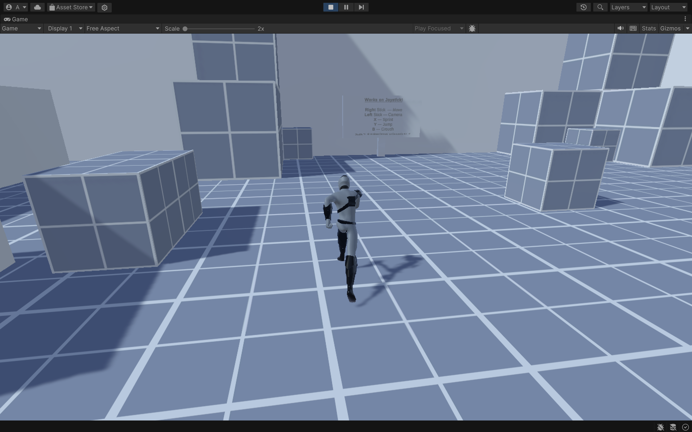

# Unity - 3rd Person Playground

This is a simple 3rd person playground project for Unity.

> Screenshot of the project

## Dependencies

This project uses the following dependencies from the Unity Asset Store:

- [Environment - SpeedTutor Tutorial Level](https://assetstore.unity.com/packages/3d/environments/speedtutor-tutorial-level-free-159460)
- [Character - EasyStart Third Person Controller](https://assetstore.unity.com/packages/3d/characters/humanoids/lowpoly-mushroomman-character-287820)
